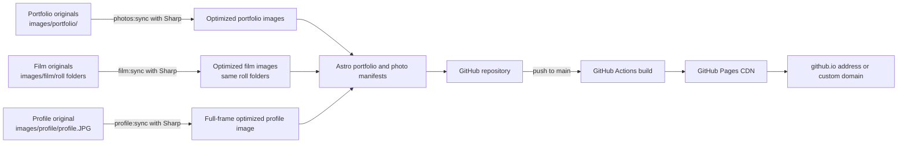

# Linquan Sun Photography

A lightweight, static portfolio for Linquan Sun’s photographs.

> The site implementation was generated with OpenAI Codex using the GPT-6 model. The photographs are Linquan Sun’s work; they are not AI-generated.

## Architecture

- **Astro** builds static HTML, CSS, and JavaScript. There is no application server or database to maintain.
- **GitHub** stores the site source, photo manifests, and optimized portfolio and film images. Camera originals stay in local source folders and are ignored by Git.
- **GitHub Actions and GitHub Pages** build and serve the site. A custom domain can point to Pages when ready.
- If the collection approaches GitHub Pages’ published-site size limit, the next step is to move photo assets to object storage such as Cloudflare R2 while keeping the site and its manifest in Git. The static pages can also be split into category pages if loading the full collection on one page becomes unwieldy.

## Photo workflow

1. Put digital photo originals into folders under `images/portfolio/`. Folder names become gallery categories; nested folders become nested category names. Empty folders are omitted. The `style` and `pswp` folders are excluded.
2. Run `pnpm photos:sync`. Sharp reads and rotates images according to their orientation, then creates 2400px display images and 640px thumbnails under `public/images/gallery/`. `src/data/photos.json` is regenerated, including a monochrome flag so the B&W preview control is hidden for already monochrome photographs.
3. Photos are grouped by folder and sorted by filename within each folder, independent of image orientation.
4. Put film scans into `images/film/`, keeping one folder per roll (and any nested folders you want). Run `pnpm film:sync` to create optimized copies under `public/images/film/` while keeping the roll and subfolder names. It also refreshes `src/data/film.json`. The **Film photographs** link opens a separate `/film/` gallery grouped by those folders.
5. Keep the profile source at `images/profile/profile.JPG`. Run `pnpm profile:sync` to create a full-frame, optimized `public/images/profile.jpg` shown on the About page.
6. Review the site locally, then commit generated assets and manifests with any code changes.

The public photo copies have their EXIF data removed to avoid accidentally publishing private details such as GPS coordinates. Optional display metadata can be added to the matching entries in `src/data/photos.json` and `src/data/film.json`: `title`, `location`, `date`, `camera`, and `lens`.

The portfolio displays responsive galleries with a zoomable lightbox and a reversible black-and-white preview. The preview control is hidden for photos already detected as monochrome. Thumbnails load lazily; clicking a photo loads its larger display image.

Keep camera originals backed up separately. Only curated, optimized images belong in this repository.

## Commands

The project uses Node.js 24 and pnpm 11.19.0. Run these from the repository root.

| Task | Command |
| --- | --- |
| Install dependencies | `pnpm install` |
| Start the local development site | `pnpm dev` |
| Regenerate the digital photo gallery after changing `images/portfolio/` | `pnpm photos:sync` |
| Regenerate the film gallery after adding, removing, or replacing files under `images/film/` | `pnpm film:sync` |
| Regenerate the full-frame profile image after changing `images/profile/profile.JPG` | `pnpm profile:sync` |
| Build the production site | `pnpm build` |
| Preview the production build locally | `pnpm preview` |

After syncing new photos, refresh the local development site. Before deploying, run the relevant sync command(s), then `pnpm build`; commit the generated images and manifests along with the changes. GitHub Actions builds and deploys the committed site, so it does not need access to the ignored camera scans.

## Deployment

The GitHub Actions workflow builds and deploys commits pushed to `main`. In the repository’s **Settings → Pages**, select **GitHub Actions** as the deployment source.

## Custom domain

Configure the domain’s DNS for GitHub Pages, then add the domain under **Settings → Pages**. Add a `public/CNAME` file containing the domain name and update `site` in `astro.config.mjs` to the matching `https://` URL. The GitHub Pages documentation covers [custom-domain setup](https://docs.github.com/en/pages/configuring-a-custom-domain-for-your-github-pages-site).
