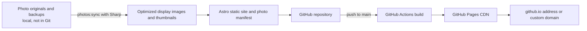

# Linquan Sun Photography

A lightweight, static portfolio for Linquan Sun’s photographs.

> The site implementation was generated with OpenAI Codex using the GPT-6 model. The photographs are Linquan Sun’s work; they are not AI-generated.

## Architecture



- **Astro** builds static HTML, CSS, and JavaScript. There is no application server or database to maintain.
- **GitHub** stores the site source, photo manifest, and selected optimized portfolio images. Original photo archives stay in a separate backup and are ignored by Git.
- **GitHub Actions and GitHub Pages** build and serve the site. A custom domain can point to Pages when ready.
- If the collection approaches GitHub Pages’ published-site size limit, the next step is to move photo assets to object storage such as Cloudflare R2 while keeping the site and its manifest in Git. The static pages can also be split into category pages if loading the full collection on one page becomes unwieldy.

## Photo workflow

1. Put photo originals into folders under `images/portfolio/`. Folder names become gallery categories; nested folders become nested categories. Empty folders are omitted. The `style` and `pswp` folders are excluded.
2. Run `pnpm photos:sync`. Sharp reads and rotates images according to their orientation, then creates 2400px display images and 640px thumbnails under `public/images/gallery/`. `src/data/photos.json` is regenerated at the same time.
3. Photos are grouped by folder and sorted by filename within each folder, independent of image orientation.
4. Review the site locally, then commit the generated gallery files and photo manifest along with any code changes.

The public copies have their EXIF data removed to avoid accidentally publishing private details such as GPS coordinates. Optional display metadata can be added to the matching entry in `src/data/photos.json`: `title`, `location`, `date`, `camera`, and `lens`.

The portfolio displays responsive photo galleries with a zoomable lightbox and a reversible black-and-white preview. Thumbnails load lazily; clicking a photo loads its larger display image.

Keep camera originals backed up separately. Only curated, optimized images belong in this repository.

## Local development

The project uses Node.js 24 in its deployment workflow and pnpm 11.19.0.

```sh
pnpm install
pnpm dev
```

Create and inspect a production build with:

```sh
pnpm build
pnpm preview
```

Regenerate the gallery after adding or changing source photos with:

```sh
pnpm photos:sync
```

## Deployment

The GitHub Actions workflow builds and deploys commits pushed to `main`. In the repository’s **Settings → Pages**, select **GitHub Actions** as the deployment source.

## Custom domain

Configure the domain’s DNS for GitHub Pages, then add the domain under **Settings → Pages**. Add a `public/CNAME` file containing the domain name and update `site` in `astro.config.mjs` to the matching `https://` URL. The GitHub Pages documentation covers [custom-domain setup](https://docs.github.com/en/pages/configuring-a-custom-domain-for-your-github-pages-site).
